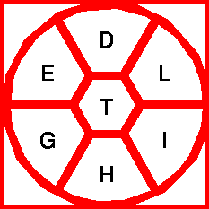
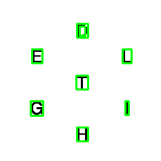

```{r setup, include=FALSE}
knitr::opts_chunk$set(echo = TRUE)
library(reticulate)
library(dplyr)
library(ggplot2)
```

Code for post at https://github.com/slopp/nytbee

The [New York Times Spelling Bee](https://www.nytimes.com/puzzles/spelling-bee) is a game where players try to spell valid words using 7 letters. The 7 letters can be repeated any number of times. In each game, one letter is required and must be included in any word. In each game there is at least 1 pangram, which is a word that includes all 7 letters at least once.

Players get points based on the length of each word they can spell. Pangrams are worth extra points, and for me, are the most exciting part of the game. However, the game does not tell you how many pangrams exist in any given puzzle.

The goal of this analysis is to see if I can determine a model that will predict the number of pangrams given information I have at the start of each game. Part of that information is the game board itself, including the letters and the required letter used in the puzzle. The other piece of information is the genius score.


What is the genius score?

Because some puzzles are not as conducive to creating words, it is not possible to compare one game to another based solely on point totals. Instead, the game makers apply a normalizing function that translates scores into categories based on the max possible score. For example, in the spelling bee on 5/31/2021, the rankings and associated minimum required points were:

Beginner (0)\
Good Start (5)\
Moving Up (13)\
Good (22)\
Solid (40)\
Nice (67)\
Great (108)\
Amazing (135)\
Genius (188)


My goal is to see if I can determine the number of pangrams, $p$, based on the point total required for the genius category $g$ plus information about the letters in the game, $l$. In other words:

$$
\hat{p} = \hat{h}(g, l)
$$


## Get the data

A generous spelling bee enthusiast maintains a website <https://nytbee.com> that contains helpful information about each daily bee. Looking at the site before starting the game is one way to determine the number of pangrams in play... however, I believe looking at this site before playing a puzzle is akin to cheating! That said, the daily information is invaluable to creating my model. Historical data is available at links formatted like: https://nytbee.com/Bee_yyyymmdd.html

My first task was to create a tidy dataset based on parsing these web pages. This turned out to be quite an involved task:

- Used beautiful soup in Python to parse each URL to get the metadata
- Created an OCR workflow, also in Python, to parse the letters from the static image of the game board

The details of this workflow are detailed at the bottom section of this post. For now, let's take a quick look at the result of this workflow:

```{r}
# run to create the dataset, takes a few minutes
# reticulate::source_python('ocr.py')

data <- readr::read_csv('nytbee.csv')

# add a column counting how many letters we claim to have for each day
# remember, each day should only have 7 letters
# result: oh no
data <- data %>% 
  group_by(date) %>% 
  count() %>% 
  right_join(data) %>% 
  rename(total_letters_found = n) %>% 
  select(-X1)

# oh no
hist(data$total_letters_found)

# less than half the days correctly have 7 letters
data %>% 
  filter(total_letters_found ==7) %>% 
  group_by(date) %>% 
  n_groups()

# what went wrong?
# result: letters we are missing: O Q X
data %>% 
  pull(letters) %>% 
  unique() %>% 
  setdiff(LETTERS, .)

# we shouldn't have more than one of any letter
# in a given day per game rules
# result: this validation was successful
data %>% 
  group_by(date, letters) %>% 
  count() %>% 
  filter(n > 1)

# so what extra letters are being identified?

# lets look at letters that show up in cases where wemore than 7 are found
# result: we have many A and S, so those could be mis-identified or maybe those are just common?
data %>% 
  filter(total_letters_found > 7) %>% 
  group_by(letters) %>% 
  count() %>% 
  arrange(desc(n))

# what are A and S correlated with?
# result: they could be confused with L, N, |, T, C, E, R
a_s_days <- data %>% 
  filter(letters %in% c("S", "A")) %>% 
  pull(date)

```

End result:

My OCR tool is not quite good enough. Out of 365 days, it produced 142 accurate datasets with 7 letters, less than 50% of the attempted 365 days! Of the inaccuracies, the biggest is missing letters: it did not identify any O, Q, or Xs. These letters have a major impact on game scoring, so any model of the game would have significant bias without days that included these letters. The days with too many letters are equally troubling. In addition to the wrong letters, my determination of the required letter was based on the OCR analysis recording identifying letters in a consistent order. If a letter can't be found, this messes with the order, and prevents the data about the required letter from being accurate. In other words, where the `total_letters_found != 7`, it is safe to assume the required letter is off as well.

## Safe analysis despite data prep failures

Before completely calling it, we can used the data we successfully parsed off the HTML pages (not the image data) to see if there is a simple relationship between the genius score and the number of pangrams:

```{r}

data %>% 
  select(-letters) %>% 
  unique() %>% 
  ggplot(aes(min_genius, num_pangram)) + 
  geom_jitter(alpha = 0.3) + 
    geom_smooth() + 
    labs(
      title = "You can't use the genius score to predict the # of pangrams",
      subtitle = "Unless the score is north of 250, in which case you can look for at least 3",
      y = "Number of Pangrams",
      x = "Min Points to be Genius"
    ) + 
    theme_minimal() 
```

There is not a great relationship. There are a lot of games where there is only one pangram and the scores in those games varies significantly! This chart shows us that there are some outlying games with more than 4 pangrams, and that those mega-games tend to be correlated with high scores. But score alone won't help you guess whether the game has 1, 2, 3, or 4 pangrams.

We can tell there is not a statistically significant difference if we compare the IQR within the box plots:

```{r}
ggplot(data, aes(as.factor(num_pangram), min_genius)) + 
  geom_boxplot() + 
  labs(
    x = "Number of Pangrams",
    y = "Min Points to be Genius",
    title = "Games with 1-4 pangrams can have similar point totals"
  ) + 
  theme_minimal()
```

Finally, we can use the scraped data to double check that the game makers fairly assign the minimum genius score, by looking at the percentage of total points you have to get to be considered a genius:

```{r}
data %>% 
  mutate(perc_genius = min_genius / max_score) %>% 
  ggplot(aes(perc_genius)) + 
  geom_histogram() + 
  theme_minimal() + 
  labs(
    x = "Percentage of Points Needed to be Genius",
    y = "# of Games",
    title = "The genius score is roughly 70% of the max game points",
    subtitle = "C- is Genius?!"
  )
```
This histogram shows that the game maker are very accurate, as the percentage of points required is a fixed 70%. 70% to be a genius? Nice. I am guessing  the variance here is that each word has an integer number of points, so its not always possible to have exactly 70% of the max point total. We would NOT want to ever fit a model that includes max point and genius points since the two are almost 100% colinear. What about the relationship between max points and number of words?

```{r}
ggplot(data, aes(max_words, min_genius)) + 
  geom_point() + 
  geom_smooth() + 
  theme_minimal() + 
  labs(
    x = "Max # of Words",
    y = "Min Genius Score",
    title = "The possible score is related to the number of words you can make",
    subtitle = "This relationship would be great for pangram models, but we don't know the # of words ahead of playing"
  )
```

As expected, given how the scoring works, the score (proxied by the minimum genius score) is closely correlated with the maximum number of words, but there is some variance. In fact, discrepancies between this relationship might point at games with a large number of pangrams! However, we don't know the number of words going into a game, so this information wouldn't help a player identify how many pangrams there may be. That said, we can safely assume that if genius score is high, the puzzle likely has more words!

Finally, one last area of investigation we could safely look at with our data is how the occurence of pangrams have changed over time. Are we getting more pangrams?

```{r}
data %>% 
  group_by(date) %>% 
  filter(num_pangram > 1) %>% 
  select(-letters, -req_letter, -total_letters_found) %>% 
  unique() %>% 
  arrange(desc(num_pangram))
  
```
To fairly do this analysis we'd want to pull more data, but of the 22 puzzles with more than 3 pangrams, 13 occurred in 2021 vs 9 in 2020. While not a dramatic increase YoY, all of the really outlying pangram games have been in 2021. Its a good year for pangram hunters.

## Sketchy and biased analysis

Using the biased data that I had, I was curious if there was any pattern between a required letter and the likelihood of more than 2 pangrams?  In other words, if I see a certain required letter, should I be on the pangram hunt?

```{r}
data %>%
  filter(total_letters_found == 7) %>% 
  select(-letters) %>% 
  unique() %>% 
  group_by(req_letter) %>% 
  filter(num_pangram > 2) %>% 
  count() %>% 
  arrange(desc(n)) %>% 
  rename(`Number of games > 2 pangrams` = n)
```
Really interesting! I would have expected more pangrams if the required letter was a vowel.

I looked at some of the specific date where OCR failed, especially our outlier day of Jan 22, 2021, and low and behold, these mis-placed days often DID have vowels as the required letter. Our conclusions here are sketchy. Garbage in, garbage out. Always get your data prep right!

Just how biased is our missing data w.r.t pangrams?

```{r}
data %>%
  select(-letters) %>% 
  unique() %>% 
  mutate(bad_data = ifelse(total_letters_found == 7, FALSE, TRUE)) %>% 
  ggplot() + 
  geom_bar(aes(as.factor(num_pangram), fill = bad_data), position = "dodge") + 
  labs(
    x = "Number of Pangrams",
    y = "Number of Games",
    fill = "Affected by Bad OCR"
  ) + 
  scale_fill_brewer() + 
  theme_minimal()
```

## More on the data prep

So what is the deal with OCR? Each of the nytbee webpages with historical spelling bee data has an image that represents the game board:


My goal in doing the data preparation was to parse all of the historical webpages, and as part of the parsing, convert this image into tidy data. I wanted to know the letters available on the board each day, along with the required center letter.

It turns out, parsing this image was harder than expected. My ultimate strategy was to use OpenCV to find the letters in the inage, and then use tesseract to identify the character. I'll walk through the Python code below, including helpful images along the way.

I used a Python container running in Kubernetes for my work. The container hepled me easily create a virtualenv and a system environment with the proper OpenCV and Tesseract dependencies, and Kubernetes was just what I had around for running the container on a nicely networked EC2 instance.

```python
# first load the img
import skimage
import cv2
url = "https://nytbee.com/pics/20210531.png"
img = io.imread(url)

```


```python
# next identify the countours
gray = cv2.cvtColor(img, cv2.COLOR_BGR2GRAY)

# find the contours
contours,_=cv2.findContours(gray, cv2.RETR_TREE,
                            cv2.CHAIN_APPROX_SIMPLE)
                            
                            
# Loop through the contours... I used a trick to separate the letter contours from the polygon contours based on their area
# for the first loop we'll eliminate the polygon lines
img2 = img.copy()
for cnt in contours :
      # for each countour rough out the area size
      area = cv2.contourArea(cnt)
      
      # if the area is large its a polygon not a letter, so flag it
      if area > 400: 
        approx = cv2.approxPolyDP(cnt, 
                                  0.009 * cv2.arcLength(cnt, True), True)
        cv2.drawContours(img2, [cnt], 0, (255,255,255), 4)

cv2.imwrite("polygons.png", img2)
```



```python
# now we loop through the smaller "letter" polygons
# here I will show you the boxes
for cnt in contours :
      # for each countour rough out the area size
      area = cv2.contourArea(cnt)
      
      # if the area is small zoom in on it as a letter
      if area < 300: 
         x, y, w, h = cv2.boundingRect(cnt)
         rect = cv2.rectangle(img2, (x, y), (x + w, y + h), (0, 255, 0), 2)
        

cv2.imwrite("letters.png", img2)
```



```python
# finally, this time as we loop through, we'll run the predictions using tesseract
ocr_letters = list()
for cnt in contours :
    # for each countour rough out the area size
    area = cv2.contourArea(cnt)
    
    # if the area is small, then figure out the letter!
    if area <300:
      x, y, w, h = cv2.boundingRect(cnt)
      cropped = img2[y:y + h, x:x + w]
      ocr_letters.append(pytesseract.image_to_string(cropped, config="--psm 10"))   
```
 
```
['H\n\x0c', '|\n\x0c', 'G\n\x0c', 'T\n\x0c', '[L\n\x0c', 'E\n\x0c', 'D\n\x0c']
```

To view the full prep code, take a look at `ocr.py` in the GitHub repository.
The letters are mostly correct, we just need to clean up the predictions a bit.

At this point though, it'd be good to understand why we are doing so poorly on some images! And that is a post for another holiday...
        