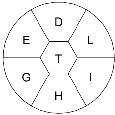

```{r setup, include=FALSE}
knitr::opts_chunk$set(echo = TRUE)
```

In my [last post](https://loppsided.blog/posts/hunt-for-the-pangrams/) I started work to create a dataset that compiles information from the [NYTimes Spelling Bee](https://www.nytimes.com/puzzles/spelling-bee). The work essentially parses this [excellent fan website](https://nytbee.com) to create a tidy dataset. I discoverd in my last post that parsing an image to get information on the daily game board was a little tricky. In this post I talk about how I fixed the OCR process and then look at some of the results.


## Updating my Image Processing Routine

My last post discovered that a naive use of OpenCV and `pytesseract` was not going to correctly parse my images, which look like this:



In particular, the code was struggling to identify circular letters O and Q, it was failing to find X, and it was finding too many letters in some cases.

To rectify this issue I did three things:

1. I used my data analysis to identify a few solid test images
2. I switched from using RStudio as a Python editor to VS Code to take advantage of a better debug workflow
3. I ended up tuning my cropping strategy and hard-coded a few image / classification rules

I should have mentioned that in my first post I was using RStudio for all of my R and Python development. I wanted to see how far RStudio could take me in Python development. The result was pleasant, RStudio provides a Python environment pane for viewing objects as you execute code. This environment pane is really handy for interactive data science tasks, because it allows you to look at objects without requiring a special debug mode. However, in my case, the core part of my code was a loop:

```python
for contour in contours:
      # select cropped section
      # classify cropped section as letter
```

To debug what was going wrong with certain characters I needed a fast and easy way to pause this loop and inspect the cropped image, the prediction, etc. This type of workflow is exactly what debuggers were built for, and in my case, that meant turning to VS Code because RStudio does not currently have a Python debugger.

Once I was setup with a debugger and test cases, it was relatively easy to see why classification was failing for certain characters. I realized right away that I had made a mistake in my original code. I was cropping and classifying the original image, even though I had generated contours off of a grayscale transformation of the image. Fixing that problem eliminated some of the cases where OCR found too many characters, and it allowed tesseract to correctly identify `X`. In my original code I had used a simple rule to determine if a contour was a character or another part of the image. I solved another set of my test cases by making this rule more precise to eliminate contours that were detecting partial characters within other characters. Finally, I discovered that the OpenCV contour, which I was using to crop one character out of my larger image, was not working well for O and Q.

At this point I had an interesting thought. In my case, all of my images were essentially the same. The letters were positioned exactly in the same locations, and the 26 letters were always the same whenever the appeared in the image. This realization meant I didn't actually need to be doing ML at all...I decided to take this shortcut by saving samples of O and Q. I then added a simple case statement to check my cropped image against those two samples, providing 100% accuracy for my classification of those two letters. I could have followed the same procedure for the other 24 letters, but at this point the ML approach was working for everything else and I decided to let it be.

The resulting code can be seen in the post's github repo: https://github.com/slopp/nytbee. A summary of the core OCR algorithim is:

```python
# use contours to dissect the parts of our image
contours,_=cv2.findContours(gray, cv2.RETR_TREE,
                              cv2.CHAIN_APPROX_SIMPLE)
                              
ocr_letters = list()

for cnt in contours :
    # for each countour rough out the area 
    # we know the approx size of our letters, so ignore everything else
    area = cv2.contourArea(cnt)
    
    
    if area <300 and area>50:
      # if the contour looks like a letter and is the right size, creating a cropped
      # image that contains just the character
      x, y, w, h = cv2.boundingRect(cnt)
      cropped = gray[y:y + h, x:x + w]
      
      # if the cropped image matches an O or a Q, assign the label
      if np.array_equal(cropped, o_img):
        ocr_letters.append('O')
      elif np.array_equal(cropped, q_img):
        ocr_letters.append('Q')
      else:
      # otherwise, have pytesseract tell us what the image is
        ocr_letters.append(pytesseract.image_to_string(cropped, config="--psm 10"))
```

## Pangram Analysis

With my data corrected, I was able to return to my original analysis. Are there certain letters, required letters, or genius scores that are predictive of the number of pangrams?

```{r}
library(dplyr)
library(ggplot2)
data <- readr::read_csv('nytbee.csv')

data <- data %>% 
  group_by(date) %>% 
  count() %>% 
  right_join(data) %>% 
  rename(total_letters_found = n) %>% 
  select(-X1)

head(data)
```

Using this data we can learn one thing... games with many pangrams are outliers, and predicting outliers is hard.

```{r}
data %>% 
  ggplot() + 
  geom_histogram(aes(num_pangram)) + 
  theme_minimal() +
  labs(
    x = "Number of Pangrams",
    y = "Games with that Many Pangrams",
    title = "Games with more than 3 pangrams are extreme outliers"
  )
```

```{r}
data %>% 
  select(-letters) %>% 
  unique() %>% 
  ggplot(aes(x = reorder(req_letter, num_pangram), y =num_pangram)) +
    geom_boxplot() +
    coord_flip() + 
  theme_minimal() + 
  labs(
    x = "Required Letter",
    y = "Number of Pangrams",
    title = "No required letter is a greater predictor of the number of pangrams"
  )
```

```{r}
data %>% 
  unique() %>% 
  ggplot(aes(x = reorder(letters, num_pangram), y =num_pangram)) +
    geom_boxplot() +
    coord_flip() + 
  theme_minimal() + 
  labs(
    x = "Letter",
    y = "Number of Pangrams",
    title = "Non-required letters aren't good pangram predictors either"
  )
```

We can refine this view a bit with a model: 

```{r}
library(tidymodels)
lm_mod <- 
  logistic_reg()

data$num_pangram <- as.factor(data$num_pangram)
                              
lm_fit <- 
  lm_mod %>% 
  fit(num_pangram ~ min_genius + req_letter + letters, data = data)
views <- tidy(lm_fit)

views %>% 
  arrange(desc(estimate))
```

## Summary

- These required letter suggest you should be on the pangram hunt: W,K,D  
- The higher the genius score the higher the number of pangams, but only marginally   
- The required letter tells you more about the potential for pangrams, but some letters are slightly predictive of more pangrams if they show up in the game even if they are not required. Letters to watch for still include W and K, but also U and H.  
- Q is an interesting letter to model since it shows up rarely. It may suggest a higher number of pangrams, but the statistical evidence is weaker  


